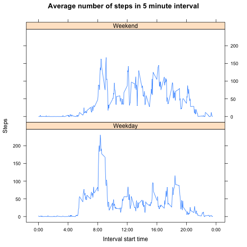

# Reproducible Research: Peer Assessment 1

This document describes the analysis of a data set that contains movement data.  

## Loading and preprocessing the data

To load the raw data we use the function *read.csv()*. This assumes that the zip file has been unzipped and the csv file is available in the directory.


```r
rawdata <- read.csv("activity.csv") 
summary(rawdata)
```

```
##      steps               date          interval   
##  Min.   :  0.0   2012-10-01:  288   Min.   :   0  
##  1st Qu.:  0.0   2012-10-02:  288   1st Qu.: 589  
##  Median :  0.0   2012-10-03:  288   Median :1178  
##  Mean   : 37.4   2012-10-04:  288   Mean   :1178  
##  3rd Qu.: 12.0   2012-10-05:  288   3rd Qu.:1766  
##  Max.   :806.0   2012-10-06:  288   Max.   :2355  
##  NA's   :2304    (Other)   :15840
```

```r
tail(rawdata)
```

```
##       steps       date interval
## 17563    NA 2012-11-30     2330
## 17564    NA 2012-11-30     2335
## 17565    NA 2012-11-30     2340
## 17566    NA 2012-11-30     2345
## 17567    NA 2012-11-30     2350
## 17568    NA 2012-11-30     2355
```

The *summary()* and *tail()* commands, with the instructions describe the data set:  
1) There are 288 samples per day for intervals 0 (starting at 0:00) to 2355 (starting 23:55).  
2) The data runs from beginning of October to end of November.  
3) For 2304 out of 17568 samples the value of *steps* is NA (= missing), and of the non-NA samples, the most common value is 0 steps, the average is about 37 and the maximum is 806 steps.  

## What is mean total number of steps taken per day?

We can sum the steps by date using *tapply()*.

```r
stepsperday <- tapply(rawdata$steps, rawdata$date, sum)
summary(stepsperday)
```

```
##    Min. 1st Qu.  Median    Mean 3rd Qu.    Max.    NA's 
##      41    8840   10800   10800   13300   21200       8
```

With the information about minimum and maximum values, we can define the buckets in the histogram.


```r
hist(stepsperday, breaks=seq(0,22000,2000), 
     main="Total steps per day",xlab="Steps")
```

 

The mean and median total steps per day can be calculated and visually verified in the histogram.


```r
mean(stepsperday, na.rm=TRUE)
```

```
## [1] 10766
```

```r
median(stepsperday, na.rm=TRUE)
```

```
## [1] 10765
```

## What is the average daily activity pattern?

We can calculate the average of steps by interval using the *aggregate()* function.


```r
avgday <- aggregate(rawdata$steps, list(rawdata$interval), mean, na.rm=TRUE)
names(avgday) <- c('interval','avgsteps')
summary(avgday)
```

```
##     interval       avgsteps     
##  Min.   :   0   Min.   :  0.00  
##  1st Qu.: 589   1st Qu.:  2.49  
##  Median :1178   Median : 34.11  
##  Mean   :1178   Mean   : 37.38  
##  3rd Qu.:1766   3rd Qu.: 52.83  
##  Max.   :2355   Max.   :206.17
```

Plotting the data is straightforward, but we replace the X axis labels with strings that make the interval more readable.


```r
plot(avgday$interval, avgday$avgsteps, type="l", 
     main="Average number of steps in 5 minute interval", 
     xlab="Interval start time", ylab="Steps", axes = FALSE)
axis(2)
axis(1, at=seq(0,2400,400), 
     labels=c("0:00","4:00","8:00","12:00","16:00","20:00","0:00"))
```

 


The maximum (average) number of steps can be calculated, and the matching interval can be found easily as well. The result matches the highest peak in the previous plot: the average number of steps is about 206 in the 5 minute interval from 8:35.


```r
maxsteps <- max(avgday$avgsteps, na.rm=TRUE)
print(maxsteps)
```

```
## [1] 206.2
```

```r
avgday$interval[match(maxsteps,avgday$avgsteps)]
```

```
## [1] 835
```

## Imputing missing values

We can calculate the number of missing values in the steps column of the raw data, and get the same result as when using the *summary()* function.


```r
nas <- is.na(rawdata$steps)
sum(nas)
```

```
## [1] 2304
```

Plotting the missing data by date reveals that certain dates are fully missing, so we can not replace an NA with another steps value in the same day.


```r
missingdates <- rawdata$date[nas]
plot(missingdates, main="Missing steps values by date", 
     xlab="Date", ylab="Number of missing values")
```

 

The missing values can be replaced with the average for that interval over the original two months data (calculated over days the data is not missing), as calculated earlier in the variable *avgday*. (*nas* gives the indices of the data frame where the steps are missing, and the *match()* function translates every index into a index into the *avgday* results.)


```r
fixeddata <- rawdata
fixeddata$steps[nas] <- 
    avgday$avgsteps[match(fixeddata$interval[nas],avgday$interval)]
summary(fixeddata)
```

```
##      steps               date          interval   
##  Min.   :  0.0   2012-10-01:  288   Min.   :   0  
##  1st Qu.:  0.0   2012-10-02:  288   1st Qu.: 589  
##  Median :  0.0   2012-10-03:  288   Median :1178  
##  Mean   : 37.4   2012-10-04:  288   Mean   :1178  
##  3rd Qu.: 27.0   2012-10-05:  288   3rd Qu.:1766  
##  Max.   :806.0   2012-10-06:  288   Max.   :2355  
##                  (Other)   :15840
```

Now we can recalculate the average total steps per day, and the median and average over the 2 months period. The results are not very different from the original results. It seems that the missing values are not concentrated in days with a high or low number of steps.


```r
stepsperday <- tapply(fixeddata$steps, fixeddata$date, sum)
hist(stepsperday, breaks=seq(0,22000,2000), 
     main="Average steps per day, with missing values imputed",xlab="Steps")
```

 

```r
mean(stepsperday)
```

```
## [1] 10766
```

```r
median(stepsperday)
```

```
## [1] 10766
```

## Are there differences in activity patterns between weekdays and weekends?

Based on the date we can find the day of the week for each sample, so we can split the data into weekend and weekday samples. With this extra information we can again calculate the average number of steps per interval, and additionally distinguish averages by weekday and weekend.


```r
isweekend <- function(s) {
    weekdays(as.Date(s, "%Y-%m-%d")) %in% c("Saturday","Sunday")}
fixeddata$weekend <- ifelse(isweekend(fixeddata$date),"Weekend","Weekday")
avgday_weekend <- aggregate(steps ~ interval+weekend, data=fixeddata, FUN=mean)
```


Using the lattice library, we can plot the results like earlier, but now split by weekend vs. weekday. As expected, we can see that the day starts a bit later in the weekend (few people starting before 8AM), the morning peak is less pronounced in the weekend, and more steps are taken throughout the day.


```r
library(lattice)
xyplot(steps ~ interval|weekend, data=avgday_weekend, type="l", layout=c(1,2), 
       main="Average number of steps in 5 minute interval", 
       xlab="Interval start time", ylab="Steps", 
       scales=list(x=list(at=seq(0,2400,400), 
                          labels=c("0:00","4:00","8:00","12:00","16:00","20:00","0:00"))))
```

 
